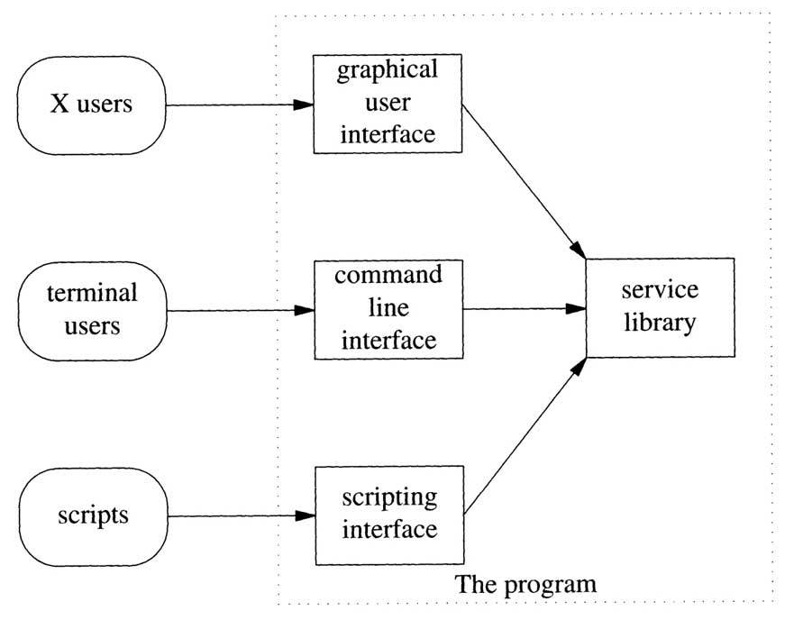
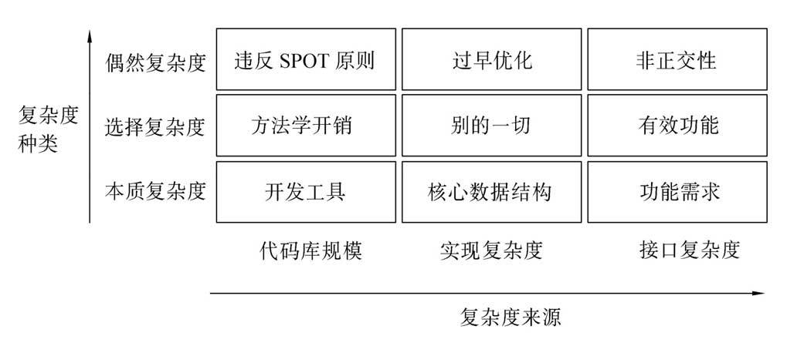

## UNIX编程艺术

**The Art of UNIX Programming**

[美] Eric S. Raymond 著，姜宏、何源、蔡晓骏 译

### 缩略词
API = Application Programming Interface 应用编程接口：同可链接程序库或操作系统内核或两者通信的过程调用集。
BSD = Berkeley System/Software Distribution：在1976到1994年之间，由加利福尼亚大学伯克利分校计算机科学研究组发布的Unix版本许多开源Unix都从此继承而来。
CLI = Command Line Interface 命令行界面
GUI = Graphical User Interface 图形用户界面：应用程序界面的现代风格，与老式CLI或roguelike风格不同，使用鼠标、窗口及图标，由Xerox PARC中心在1970年代创造。
IDE = Integrated Development Environment 集成开发环境：代码开发的GUI工作台，功能包括符号调试器、版本控制以及数据结构浏览。在 Unix下通常并不使用。

GNU = GNU's Not Unix! GNU不是Unix：一个完全自由的Unix克隆版本，Richard StallMan编制
GCC = GNU Compiler Collection GNU编译器集合：自由软件基金会的GNU C编译器
GNOME = GNU Network Object Model Environment GNU网络对象模型环境
GPL = General Public License 通用公共许可证
FSF = Free Software Foundation 自由软件基金会
IPC = Inter-Process Communication 进程间通讯：独立地址空间运行进程的数据传输方法。
Windows NT = Windows New Technology

CSV = Comma-Separated Values 逗号分隔值/字符分隔值
DSV = Delimiter-Separated Values 分隔符分隔值
MIME = Multipurpose Internet Mail Extension 多用途网际邮件扩充协议：一系列的RFC，描述了在RFC-822邮件中内嵌二进制和multipart信息的标准。
XSLT = Extensible Stylesheet Language Transformations 可扩展样式表转换语言
DTD = Document Type Definition 文档类型定义

SOAP = Simple Object Access Protocol 简单对象访问协议
NFS = Network File System 网络文件系统
W3C = World Wide Web Consortium 万维网联盟
CGI = Common Gateway Interface 公共网关接口
WYSIWYG = What You See Is What You Get 所见即所得
PIL = Python Imaging Library Python图像库
BNF = Backus-Naur Form 巴科斯—诺尔范式

VCS = Version-Control System 版本控制系统
SCCS = Source Code Control System 源码控制系统
RCS = Revision Control System 修订控制系统
CVS = Concurrent Version System 并发版本系统
FAQ = Frequently Asked Questions 常见问题解答

IEEE = Institute of Electrical and Electronic Engineers 美国的电气电子工程协会
FHS = Filesystem Hierarchy Standard 文件系统层次标准
LSB = Linux Standards Base Linux标准基础
IETF = Internet Engineering Task Force 互联网工程任务组：负责定义诸如TCP/IP之类互联网协议的实体。一个松散平等的组织，主要由技术人员构成。
PDF = Portable Document Format 可移植文档格式：控制打印机和其它成像设备的PostScript语言，设计来将数据流输出给打印机。而PDF是一系列的PostScript页，并包入标记描述，可以方便作为显示格式使用。
TEI = Text Encoding Initiative ＜http：//www.tei-c.org/＞
FO = Formatting Objects 带格式对象
Open Metadata Format 开放元数据格式 
SGML = Standard Generalized Markup Language 标准通用标记语言
RPM = RedHat Package Manager：在 Linux 下可安装二进制软件包的事实标准格式
ACL = Access Control Lists 访问控制列表
PNG = Portable Network Graphics 可移植网络图形：万维网联盟（The World Wide Web Consortium）的位图图形图像标准和推荐格式，是二进制图像格式的一个优雅设计。
RFC = Request For Comment 请求评注：一个互联网标准。当其文档作为提议被提交、处于某种目前虽不存在但期望的正式承认过程时。而正式的承认过程从未实体化。

Samba：一种在Linux系统上获取Windows文件共享的工具套件
Jabber ：一个为支持即时消息和在线状态报告而设计的对等协议
TTY = TeleTYpe 电传打字机；由虚拟控制台、串口以及伪终端设备组成的终端设备
XTerm：X Window System上的终端模拟器
Unix Shell：Unix控制台的输入命令解释器
PostScript：图像打印机的现行控制语言标准

syntactic sugar 语法糖
checkin/checkout 检入/检出

### 名人名言

Doug McIlroy：
- 用错误的方式解决正确的问题总比用正确的方法解决错误的问题好。
- Unix哲学是这样的：一个程序只做一件事，并做好。程序要能协作。程序要能处理文本流，因为这是最通用的接口。
- 要宽容的应该是规范而不是它们的解释工具。
- 在Unix中，一组程序设计时不仅要尽量考虑相互协作，而且要考虑和未知程序的协作。

Antoine de Saint-Exupéry 安东尼·德·圣埃克苏佩里：
- La perfection est atteinte non quand il ne reste rien à ajouter，mais quand il ne reste rien à enlever.
  完美之道，不在无可增加，而在无可删减。

Brian Kernighan：计算机编程的本质就是控制复杂度。
Kernighan & Plauger：90%的功能现在能实现，比100%的功能永远实现不了强。
Ken Thompson：先制作原型，再精雕细琢。优化之前先确保能用。（先能走，再学跑）
Kent Beck：先求运行，再求正确，最后求快。
Ritchie & Thompson：性能的局限不仅成就了经济性，而且鼓励了设计的简约。

### 章节语录

Henry Spencer:
Those who do not understand Unix are condemned to reinvent it,poorly.
不懂Unix的人注定最终还要重复发明一个蹩脚的Unix。

George Santayana:
Those who cannot remember the past are condemned to repeat it.
忘记过去的人，注定要重蹈覆辙。

Scott Adams:
If you have any trouble sounding condescending,find a Unix user to show you how it's done.
如果你不知道怎样表现得高人一等，找个Unix用户，让他做给你看。

C.A.R.Hoare:
There are two ways of constructing a software design.One is to make it so simple that there are obviously no deficiencies; the other is to make it so complicated that there are no obvious deficiencies.The first method is far more difficult.
软件设计有两种方式：一种是设计得极为简洁，没有看得到的缺陷；另一种是设计得极为复杂，有缺陷也看不出来。第一种方式的难度要大得多。

David Gelernter:
Beauty is more important in computing than anywhere else in technology because software is so complicated.Beauty is the ultimate defense against complexity.
美在计算科学中的地位，要比在其它任何技术中的地位都重要，因为软件是太复杂了。美是抵御复杂的终极武器。

Fred Brooks:
The programmer at wit's end...can often do best by disentangling himself from his code,rearing back,and contemplating his data.Representation is the essence of programming.
程序员束手无策……只有跳脱代码，直起腰，仔细思考数据才是最好的行动。表达是编程的精髓。

Alexander Clark:
Let us watch well our beginnings,and results will manage themselves.
积跬步，致千里。

Leonardo Da Vinci 达·芬奇:
All our knowledge has its origins in our perceptions.
我们所有的知识都来源于我们的感知。

C.A.R.Hoare:
Premature optimization is the root of all evil.
过早优化乃万恶之源。

Albert Einstein:
Everything should be made as simple as possible,but no simpler.
事情要尽可能简单，但别简单过了头。

路德维希·维特根斯坦:
The limits of my language are the limits of my world.
我语言的极限便是我世界的极限。

佚名:
Unix is user-friendly—it's just choosy about who its friends are.
Unix对用户是友好的——只不过是挑剔的友好。

《道德经》:
When the superior man refrains from acting,his force is felt for a thousand miles.
不言之教，无为之益，天下希及之。

Portability of C Programs and the UNIX System(1978) / C程序的可移植性和Unix系统（1978）:
The realization that the operating systems of the target machines were as great an obstacle to portability as their hardware architecture led us to a seemingly radical suggestion:to evade that part of the problem altogether by moving the operating system itself.
对于可移植性，目标机器的操作系统和其硬件结构都是障碍，意识到这一点，可能会导致相当激进的意见：完全规避问题的方法，就是移植操作系统本身。

Joseph Costello:
I've never met a human being who would want to read 17,000 pages of documentation, and if there was,I'd kill him to get him out of the gene pool.
我从没见过一个愿意阅读17000页文档的人，如果有，我会杀了他，这样人的基因必须抹去。

Linus Torvalds:
Software is like sex—it's better when it's free.
软件和性一样——越自由越好。

Alan Kay （1971年XEROX PARC会议上的发言）:
The best way to predict the future is to invent it.
预测未来最好的方法就是去创造未来。

### 一 场景

#### 1 哲学
Philosophy: Philosophy Matters

须弥不重，芥子不轻。
禅是一种心灵鸡汤似的东西，纯净而没有神灵的干扰——此即是禅。
禅的“教外别传，不立文字”。

策略相对短寿，而机制才会长存。
策略和机制是按照不同的时间尺度变化的，策略的变化要远远快于机制。
前端实现策略，后端实现机制。

程序得以形成严丝合缝的工具套装，而不是应景的解决对策。
趣味性是一个峰值效率的标志。
乐趣是一个符号，意味着效能、效率和高产。
编程的核心是数据结构，而不是算法。
最易用的程序就是用户需要学习新东西最少的程序——或者，换句话说，最易用的程序就是最切合用户已有知识的程序。
设计良好的程序将用户的注意力视为有限的宝贵资源，只有在必要时才要求使用。
宽容地收，谨慎地发。（宽收严发：对接收的东西要包容，对输出的东西要严格）
**小即是美。**（在确保完成任务的基础上，程序功能尽可能少）
Unix有它自己的（技术）文化；有独特的编程艺术；有一套影响深远的设计哲学。
性能—时间的指数曲线对软件开发过程所引发的结果，就是每过18个月，就有一半的知识会过时。Unix并不承诺让你免遭此劫，只是让你的**知识投资**更趋稳定。
Unix传统将重点放在尽力使各个程序接口相对小巧、简洁和正交——这也是另一个提高灵活性的方面。

Unix哲学（同其它工程领域的民间传统一样）是自下而上的，而不是自上而下的。Unix哲学注重实效，立足于丰富的经验。
Unix哲学：
1.模块原则：使用简洁的接口拼合简单的部件。
2.清晰原则：清晰胜于机巧。
3.组合原则：设计时考虑拼接组合。
4.**分离原则：策略同机制分离，接口同引擎分离**。
5.简洁原则：设计要简洁，复杂度能低则低。
6.吝啬原则：除非确无它法，不要编写庞大的程序。
7.透明性原则：设计要可见，以便审查和调试。
8.健壮原则：健壮源于透明与简洁。
9.表示原则：把知识叠入数据以求逻辑质朴而健壮。
10.通俗原则/最少惊奇原则：接口设计避免标新立异。
11.缄默原则：如果一个程序没什么好说的，就沉默。
12.补救原则：出现异常时，马上退出并给出足够错误信息。
13.经济原则：宁花机器一分，不花程序员一秒。
14.生成原则：避免手工hack，尽量编写程序去生成程序。
15.优化原则：雕琢前先要有原型，跑之前先学会走。
16.多样原则：决不相信所谓“不二法门”的断言。
17.扩展原则：设计着眼未来，未来总比预想来得快。

在输入输出方面，Unix传统极力提倡采用简单、文本化、面向流、设备无关的格式。
软件系统的透明性是指你一眼就能够看出软件是在做什么以及怎样做的。显见性指程序带有监视和显示内部状态的功能。
在有异常输入的情况下，保证软件健壮性的一个相当重要的策略就是避免在代码中出现特例。bug通常隐藏在处理特例的代码以及处理不同特殊情况的交互操作部分的代码中。
模块性（代码简朴，接口简洁）是组织程序以达到更简洁目的的一个方法。
Unix奉行的是广泛采用多种语言、开放的可扩展系统和用户定制机制。
在Unix历史中，最大的规律就是：距开源越近就越繁荣。任何将Unix专有化的企图，只能陷入停滞和衰败。
Unix操作系统的统一性理念：**一切皆文件**，管道，抢先式多任务（preemptive multitasking）等。
进程是自主运算单元的统一性记号、而进程控制是可编程的。
Unix的准绳是：程序员最清楚一切。
相对其他程序员而言，Unix程序员骨子里的传统是：更加笃信重视**模块化**、更注重**正交性**和紧凑性等问题。

#### 2 历史
History: A Tale of Two Cultures

如果有足够多眼睛的关注，所有的bug都无处藏身。
过度依赖任何一种技术或者商业模式都是错误的——相反，保持软件及其设计传统的的灵活性才是长存之道。
经济学家Clayton Christensen提出的“破坏性技术”：别和低价而灵活的方案较劲。或者，换句话说，低档的硬件只要数量足够，就能爬上性能曲线而最终获胜。
**KISS原则：K.I.S.S. = Keep It Simple, Stupid!**

#### 3 对比
Contrasts: Comparing the Unix Philosophy with Others

MacOS
MacOS操作系统的统一性理念：桌面至上。
Mac 界面方针（the Mac Interface Guidelines）：东西永远呆在你摆的地方。
MacOS X实际是两层专有代码（OpenStep移植码和经典Mac GUI）和开源Unix核心上（Darwin）的组合。

Windows NT
Unix的系统配置和用户配置数据分散存放在众多的dotfiles（名字以“.”开头的文件）和系统数据文件中，而Windows NT则集中存放在注册表中。
Windows下的Unix风格的shell功能、命令集和API函数库来自第三方，包括UWIN、Interix和开源Cygwin。
Cygwin是一个在实用工具和API两个层次上实现Unix的兼容层，而且只有极少的特性损失。Cygwin允许C程序既可以使用Unix API又可以使用原生API。

Linux
Linux的特色就是能支持其它操作系统特有文件系统格式的读写以及联网方式。Linux也支持同一硬件上的多重启动，并在Linux自身的软件中进行模拟。Linux的长期目标是包容；Linux模拟的目的就是为了吸收。
很多Linux部件源自PC爱好者，所以强调用尽量少的资源做尽可能多的事。Linux应用程序**瘦小精干**。

### 二 设计

#### 4 模块性：保持清晰，保持简洁
Modularity: Keeping lt Clean,Keeping lt Simple

模块化原则：模块之间通过应用程序编程接口（API）——一组严密、定义良好的程序调用和数据结构来通信。
紧凑性就是一个设计是否能装进人脑中的特性。
合理对待紧凑性，设计中尽量考虑，决不随意抛弃。
在纯粹的正交设计中，任何操作均无副作用；每一个动作（无论是API调用、宏调用还是语言运算）只改变一件事，不会影响其它。

重构代码就是改变代码的结构和组织，而不改变其外在行为。
重构的原则性目标就是提高正交性。

不要重复自身 Don't Repeat Yourself（真理的单点性/SPOT原则 Single Point of Truth）：任何一个知识点在系统内都应当有一个唯一、明确、权威的表述。
无垃圾，无混淆。No junk，no confusion
只有当任务的核心能够被形式化，能够建立起关于这项工作的明确模型时，才能产生最好的结果。

设计层次结构方向：
- 自底向上，从具体到抽象——从问题域中你确定要进行的具体操作开始，向上进行；
- 自顶向下，从抽象到具体——从最高层面描述整个项目的规格说明或应用逻辑开始，向下进行，直到各个具体操作。
- 程序员尽量双管齐下——一方面以自顶向下的应用逻辑表达抽象规范，另一方面以函数或库来收集底层的域原语，这样，当高层设计变化时，这些域原语仍然可以重用。

薄胶合层原则可以看作是分离原则的升华。策略（应用逻辑）应该与机制（域原语集）清晰地分离。（薄胶合/浅分层）
库分层的一个重要形式是插件，即拥有一套已知入口、可在启动以后动态从入口处载入来执行特定任务的库。这种模式必须将调用程序作为文档详备的服务库组织起来，以使得插件可以回调。

#### 5 文本化：好协议产生好实践
Textuality: Good Protocols Make Good Practice
序列化 - 保存 - 列集 marshaling
反序列化 - 载入 - 散集 unmarshaling

设计文件格式和应用协议时需要考虑的重要方面：互用性、透明性、可扩展性和存储/事务处理的经济性。
数据文件元格式是为了简化存储的序列化操作，应用协议元格式是为了简化网络间事务处理的序列化操作。

#### 6 透明性
Transparency: Let There Be Light

优雅是力量与简洁的结合。优雅的代码事半功倍；优雅的代码不仅正确，而且显然正确；优雅的代码不仅将算法传达给计算机，同时也把见解和信心传递给阅读代码的人。
不要让调试工具仅仅成为一种事后追加或者用过就束之高阁的东西。它们是通往代码的窗口：不要只在墙上凿出粗糙的洞，要修整这些洞并装上窗。如果打算让代码一直可被维护，就始终必须让光照进去。
让UI沉默只做对了一半。真正的聪明是找到一个方法，可以访问具体细节，但又不让它们太显眼。
要追求代码的透明，最有效的方法很简单，就是不要在具体操作的代码上叠放太多的抽象层。

禅的教导：去欲望，少依恋，如实见。不要让偏见和成见蒙住了眼。
可维护性：作者以外的其他人能够顺利地理解和修改软件。
应用清晰原则：选择简单的算法。
可显性降低进入门槛；透明性则减少代码中的存在成本。

注册表是Windows本身及应用程序都使用的属性数据库。所有注册记录都存放在一个大文件中。注册记录既包含文本也包含二进制数据，需要专用的编辑工具。
“注册表蠕变”。

#### 7 多道程序设计：分离进程为独立的功能
Multiprogramming: Separating Processes to Separate Function

Unix设计风格都运用“做单件事并做好”的方法，强调用定义良好的进程间通信或共享文件来连通小型进程。
实现方式：
- 降低进程生成的开销。
- 提供方法（shellout[shell 执行模块]、I/O 重定向、管道、消息传递和套接字）简化进程间通信。
- 提倡使用能由管道和套接字传递的简单、透明的文本数据格式。

IPC进程间通信的方式：
- 管道 |
- 对等方式：信号量，共享内存，临时文件，套接字
- 远程过程调用 RPC = Remote Procedure Call

接口的功能之一是充当阻隔点，防止模块的实现细节彼此泄漏。
把线程、远程过程调用接口和重量级的面向对象设计结合使用特别危险。

真实世界里的编程其实就是管理复杂度的问题。能够管理复杂度的工具都是好东西。但当这些工具的作用不是控制而是增加复杂度的时候，最好扔掉，从零开始。永远不要忘记这一点，它是Unix智慧的重要组成部分。

#### 8 微型语言
Minilanguages: Finding a Notation That Sings

声明性语义：根据约束条件安排布局。这也是现代GUI工具包展现的一个理念。
“syntactic sugar causes cancer of the semicolon”（语法糖导致分号癌）。
作为语言设计者，一个很好的原则是考虑给出错误信息的备选方式。

用 C（或 C++）编码，把结果整合到自己的微型语言中，方法：
- 扩展脚本语言：动态载入C库或模块，C入口点成为扩展语言中的可见函数。
- 嵌入脚本语言：向解释器实例发送命令然后接收结果值在C中使用。

设计数据文件格式，遵循最小立异原则，支持Unix约定（简单的面向标记的语法、支持C反斜杠约定等）。
Unix经验的长期教训之一是宏产生的问题比宏解决的问题多。
可交互的会话式语言和应用协议的主要区别在于事务边界的标定程度。

#### 9 生成：提升规格说明的层次
Generation: Pushing theSpecification Level Upwards

人类其实更善于肉眼观察数据而不是推导控制流程。
尽可能把设计的复杂度从程序代码转移到数据中是个好实践，选择便于人类维护和操作的数据表示法也是好实践。（数据驱动编程）
进行任何类型的代码生成或数据驱动编程的重要原则是：始终把问题层次往上推。
运转的Unix之禅：重用、简化、归纳、正交。
尽可能少干活；让数据塑造代码；依靠工具；把机制从策略中分离。

#### 10 配置：迈出正确的第一步
Configuration: Starting on the Right Foot

**极具价值资源：人的时间。**

传统上，一个Unix程序可以在启动环境的五个地方寻找控制信息，即配置的位置：
- /etc下的运行控制文件（或者系统中其它固有位置）。
- 由系统设置的环境变量。
- 用户主目录中的运行控制文件（或“点文件”）。
- 由用户设置的环境变量。
- 启动程序的命令行所传递的开关和参数。

好的Unix实践要求使用同参数选项预期寿命最匹配的机制：
- 对需要由系统管理员设置而不是由用户改变的整个系统级选项数据，使用整个系统里的运行控制文件
- 对改动很少但确实应该由各个用户控制的选项，使用用户主目录的运行控制文件
- 对调用时可能发生变化的选项，使用命令行开关

从最不易改变到最易改变的顺序过程：系统和用户运行控制文件、环境变量和命令行参数。

有三种约定可以区分命令行选项和普通的参数：
- 原始的Unix风格，命令行选项是以连字符“-”开头的单个字符。
- GNU风格,使用前面有两个连字符的选项关键字（而不是关键字母）。
- X toolkit风格,使用单连字符和关键字选项并由X toolkit进行解析。

在Windows中命令行隐藏在GUI下，而且也不提倡使用；选项字符通常用“/”而不是“-”。

#### 11 接口：Unix环境下的用户接口设计模式
lnterfaces: User-lnterface Design Patterns in the Unix Environment

**存在即合理。**

一个程序的接口就是程序同人类用户以及其它程序通讯的方法总和。
最小立异原则：“少来标新立异”，是所有接口设计中的通用原则，且并非仅局限于软件设计。
接口风格的五种度量标准分类：简洁、表现力、易用、透明和脚本化能力。
一个用户接口是直观的，意味着：它是可显的，用法是透明的，遵循最小立异原则。

Unix接口设计模式：
- 1 过滤器模式（输入和输出）tr, grep, sort
过滤器程序接受标准输入的数据，转换成某种格式后，再将结果发送到标准输出端。
过滤器不是交互的；也许会查询启动环境，并且通常由由命令行选项控制，但并不要求用户在输入流中输入命令或给出反馈。
  - 1.牢记 Postel 原则：宽进严出。
  - 2.在过滤时，不需要的信息也决不丢弃。
  - 3.在过滤时，绝不增加无用数据。
- 2 Cantrip模式（只输出）clear, rm, touch
没有输入，没有输出，只被调用一次，产生退出状态数值。
一个cantrip程序的行为只能由启动条件来控制。没有任何程序会比这种方式更具备脚本能力。
为程序找到一个cantrip模式的设计，需要交互时，根据接口分离引擎，正确的做法是用脚本语言编写一个交互的包装器，调用一个cantrip程序完成真正的工作。
- 3 源模式（只输出）ls, ps, who
“源”是一种类似过滤器的程序，不需要输入；它的输出只能在启动条件中控制。
- 4 接收器模式（只输入）lpr, mail
只接纳标准输入而不发送任何东西到标准输出。
- 5 编译器模式 gcc, gzip, gunzip
无标准输出也无标准输入；然而它们会将错误信息发送到标准错误端。
相反地，一个类似编译器的程序从命令行接受文件或资源名，以某种方式转换这些资源，然后再以改变后的名字输出。
- 6 ed模式 ed
需要一个文件名作为参数；然后可以修改那个文件。
在输入端，它接受命令行。一些命令的结果输出到标准输出端，作为与程序对话的一个部分，可以立即为用户所见。
- 7 Roguelike 模式
在一个视频显示终端的世界里发展而来的。既不可脚本化，又不符合为终编用户设计这个新潮流。
常常更吸引重视命令集简要性和表现力的人群，他们能够容忍记忆负担的增加。
- 8 引擎和接口分离模式（核心罗辑与用户交互分离）
将程序的“引擎”部分（程序定义域的核心算法和逻辑规格）从“接口”部分（接受用户命令、显示结果、或者提供交互帮助和命令历史记录）分离。
将“模型—视图—控制器”模式作为GUI原型的建议。
  - “模型”在Unix世界里通常称为“引擎”。模型包含了应用程序专用定义域的数据结构和逻辑。数据库服务器是模型的原型例子。
  - “视图”部分将定义域的对象渲染成可视形式。在一个真正分离得当的模型/视图/控制器应用程序中，视图组件由模型通知更新，并且自身作出相应反应，而不是由控制器或被显式更新请求来同步驱动。
  - “控制器”处理用户的请求并将它们作为命令传递给模型。

  变种：
  - 配置者/执行者组合
  接口部分控制运行时无需用户命令的过滤器或者类似守护进程的启动环境。
  - 假脱机/守护进程（spooler/daemon）组合
  一个 spooler/daemon 系统具有四个部分：一个作业发布者、一个队列列表器，一个作业撤销功能、一个带spooling的守护进程。
  - 驱动/引擎组合
  组合的接口部分需要向引擎提供命令并在启动后解释引擎的输出；而引擎的接口模式很简单。
  引擎部分是一个不需要交互、运行在后台、不需自身用户界面的程序。
  一个关键的缺陷是，通常驱动必须知道引擎的状态以便能反馈给用户。
  - 客户端/服务器组合
  用于使用TCP/IP套接字的通信、数据库等。
  - 9 CLI服务器模式
  以前端方式触发时，有一个简单的CLI界面读取标准输入而写入标准输出；
  以后台方式运行时，一旦程序检测到这种方式就将标准输入和标准输出连接到专门的TCP/IP服务端口。
  - 10 基于语言的接口模式
  Unix的shell本身即是一例。
  最有力的一种Unix设计模式，就是GUI前端同CLI微型语言后端的组合。

Unix的解法是三层结构：网页窗体调用CGI，CGI调用命令。而命令集就是自动化的接口。
界面设计师的工作是方便用户，而不是在用户面前碍眼。
沉默是金——接口设计作为整体应该遵从最小立异原则，但是信息内容应该符合最大惊奇原则——仅仅对偏离通常期望的情况详加说明。

#### 12 优化
Optimization

程序员工具箱中最强大的优化技术就是不做优化。
先估量后优化——如果有真凭实据证明应用程序运行缓慢，这时（仅当此时）才可以考虑优化代码。但付诸实施前，要先估量。
小即是美——最有效的代码优化方法就是保持代码短小简单：永远不要将核心数据结构和时间关键循环抛出缓存。
通常，指令加载要比执行花费的时间更多。

有三种常规的策略来减少时延：
- 对可以共享启动开销的事务进行批处理
- 允许事务重叠
- 缓存（兼得低延迟和高吞吐量）

引用摩尔定律：每十八个月性能翻一番。这暗示晚六个月买新机器就可以获得26%的性能提升。

#### 13 复杂度：尽可能简单，但别简单过了头
Complexity: As Simple As Possible,but No Simpler

简单性、复杂度和软件最佳规模
简单即美即雅即善，而复杂即丑即怪即恶。
更多行的代码意味着更多的bug，而调试常常是开发中最昂贵、最耗时的部分。
Unix思想中的一个主题就是强调工具小巧锐利，设计从零开始，接口简单一致。

在理想世界，Unix程序员只愿意手工打造小巧完美的软件宝石，每个都那么小巧、那么优雅、那么完美。
计算资源以及人类的思考，同财富一样，不是靠储藏而是靠消费来证明其价值的。

最简原则暗示：选择需要管理的上下文环境，并且按照边界所允许的最小化方式构建程序。
“尽可能简单，而不过于简单”，集中关注选择共享上下文环境。适用于框架、应用和程序系统。
当编制一个框架时，牢记分离原则。框架是机制，尽可能少地包含策略。
具体情况具体分析，而锻炼良好的判断力和品味恰好是软件设计者所追求的。

五个不同的Unix编辑器：纯文本编辑，富文本编辑，句法感知，批命令输出的输出解析，同辅助子进程交互。

曹洞禅：行程才是目的；顿悟在每日的实践中。

### 三 工具

#### 14 语言：C还是非C
Languages: To C or Not To C

C和C++以增加实现时间和（特别是）调试时间为代价来优化效率。
使用脚本语言的性能损失对真实世界的程序来说经常微不足道，因为真实世界的程序往往受I/O事件等待、网络延迟以及缓存列填充等限制，而非CPU的自身效率。
高级shell编程可自由混合语言编程。
混合语言是一种知识密集型（而不是编码密集型）的编程。

##### C
适用场景：要求速度最快并且具有实时需求的程序。与 OS 内核紧密联系的程序。必须在多个操作系统上移植的程序。
总结：
C 语言最佳之处是资源效率和接近机器语言。
最糟糕的地方是其编程简直就是资源管理的炼狱。

##### C++
C++的使用仍然大量集中于GUI、多媒体工具包和游戏（OO设计的主要成功领域），而在其它地方用得很少。
高效的编译型语言；对C的向上兼容；面向对象的平台；STL和泛型等最前沿的技术工具。
“C++：狗被钉上软肢而变成的章鱼”。
总结：
C++的最佳之处是编译效率以及面向对象和泛型编程的结合。
最糟之处是它非常怪异复杂，往往鼓励过分复杂的设计。
在开源世界中，有两项工作创造了有竞争能力的GUI和集成桌面生产工具包，KDE是其中资格较老的一个，而Qt工具包则是KDE项目中关键的可视组成部分。

##### Shell
Bourne shell（sh），Korn Shell（ksh），Bourne Again Shell (bash)，C shell (csh，不适合编写脚本)。
总结：
shell 的最佳之处在于书写小型脚本非常自然快捷。在Linux和其它先进的Unix变种上的标准shell已经是bash。
最糟之处在于大型shell脚本必须依靠大量辅助命令，而这些辅助命令不一定在所有目标机器上都表现一致甚至不一定存在。要在大型shell脚本中分析依赖关系并不容易。

##### Perl
总结：
Perl的最佳之处是作为强力工具以供大量涉及正则表达式匹配的小型胶合脚本使用。
最糟之处在于当程序很大时Perl会变得非常丑陋、刻板，几乎无法维护。

##### Tcl
Tcl于1990年首次发布。
Tcl（工具命令语言）是一个设计来连入C编译库的小型语言解释器，提供C代码的脚本控制（扩展脚本）。
Tcl的最初应用是控制电子仿真器所用的程序库（SPICE之类的应用程序）。
Tcl也适用于内嵌脚本——即从C程序内部调用脚本然后返回值。
最重要的两个功能是：
- Tk工具包，一种更亲切和更友好的X接口，便于快速构建按钮、对话框、菜单和滚动文本窗口并从这些构件中收集输入信息。
- Expect，一种更容易编写具有更多种响应纯交互程序的语言。

##### Python
Python最早公开发布于1991年。
非常适合构建协议机器人和网络管理工具。它也非常适合Web CGI任务。
Python擅长GUI界面的快速原型设计。
总结：
Python的最佳之处在于它鼓励清晰、易读的代码，易学易用，又能够扩展到大型项目。
最糟之处在于，不仅相对于编译语言，而且相对于其它脚本语言，它也是效率低下、速度缓慢的。

##### Java
Java公布于1995年。
Java编程语言的设计目标是“write once，run anywhere（一次编写，到处运行）”。
让“servlets”在网页应用服务器的内部运行。
Java中，类的可见/不可见区域的规定非常复杂。尽管Java的I/O功能非常强大，但文本文件的简单读取并不简单。

##### Emacs Lisp
EMACS = Editor MACroS 编辑器宏
它首次发布于1984年。
Emacs Lisp是一种脚本语言，用于Emacs文本编辑器的行为编程。它自动进行内存管理，比大多数新兴语言都更雅致、更有效。
“Emacs Makes A Computer Slow”（Emacs让计算机变慢）
“Eventually Munches All Computer Storage”（最终吃光所有计算机内存）
总结：
Emacs Lisp的最佳之处在于结合了非常优秀的基础语言Lisp，其域原语对文本操作非常有效。
最糟之处在于性能较差，难以和其它程序通讯。

##### Ruby
日本人开发的Python-Perl-Smalltalk杂交体

##### Squeak
一个开源的Smalltalk移植

##### 工具包
在2003年，有四个工具包值得认真考虑：
- Tk：原生于Tcl。Tk在其标准的窗体构件集方面也老态毕现，既有限又丑陋。
- GTK：生来就是为了取代Motif，并且支持GIMP为成百上千的GNOME应用程序所使用GTK是四个工具包中唯一的C原生接口。
- Qt：被KDE工程所使用，是原生的C++库，也有Python和Perl接口但并不同解释器本身一同发布。最佳设计和最具表达力API。
- wxWindows：使用原生的C++库，同时可以获得Perl和Python接口。基于每个平台上原生（GTK、Windows和MacOS 9）窗体构件的包装器，使编写的应用程序保留原味观感。

GTK和Qt是领跑者，都使用类似的接收/发送信号的事件处理机制。
所有四个工具包都移植到了MacOS和Windows中，选择其中任何一个都具备跨平台开发能力。
架构方面，这些程序库都是在同一抽象层次上编写的。

X工具包总结：
| 工具包    | 原生语言 | 发布对象    | 绑   | 定   | 接   | 口   | -      |
| --------- | -------- | ----------- | ---- | ---- | ---- | ---- | ------ |
|           |          |             | C    | C++  | Perl | Tcl  | Python |
| Tk        | Tcl      | Tcl, Python | Y    | Y    | Y    | Y    | Y      |
| GTK       | C        | GNOME       | Y    | Y    | Y    | Y    | Y      |
| Qt        | C++      | KDE         | Y    | Y    | Y    | Y    | Y      |
| wxWindows | C++      | -           | -    | Y    | Y    | Y    | Y      |

##### 其它

Unix中描述各式各样问题所形成的大量行话：
“aliasing bug”（别名错误）
“arena corruption”（内存分配区无效）
“memory leak”（内存泄漏）
“buffer overflow”（缓冲区溢出）
“stack smash”（堆栈崩溃）
“fandango on core”（内核混乱）
“stale pointer”（指针失效）
“heap trashing”（堆破坏）
“secondary damage”（二次损伤）

#### 15 工具：开发的战术
Tools: The Tactics of Development

##### 编辑器
vi = visual editor 可视化编辑器
EMACS = Editor MACroS 编辑器宏

vi 最适合用来完成小型任务——邮件的快速回复、系统配置的简单调整等。尤其是正在使用一个新系统（或者通过网络的远程系统）而自己的Emacs定制文件又无法唾手可得时特别有用。
在处理复杂任务、修改多个文件、需要使用其它程序结果扩展编辑时，Emacs 开始显现威力。

##### 专用代码生成器
yacc：语法分析器的生成器
lex：词法分析器的生成器

良好设计的程序代码生成器，应该永不需要用户手动地改变甚至查看到自动生成的部分。把这些做好，是代码生成器的本分。

##### 自动化编译
GNU make
GNU make的DOS和Windows移植的版本可以从FSF获取。
使用C或C++进行开发，构建应用程序的一个重要部分是将源代码变成二进制可运行文件的编译和链接命令集合。
可以在一个或多个makefile中书写项目文件之间的依赖关系。
每个makefile都由一组“生成物”构成；其中每项都告知make给定的某个目标文件会依赖哪些源文件集，并且告知make如果那些源文件比目标文件更新时该做什么。
Make文件都是文本的，不是神秘的二进制编码，因为这就是Unix的精神：可打印、可调试、可理解。

all
生成工程中所有可以执行者。
test
运行程序的自动测试套件。
clean
删除 make all 时产生的所有文件（例如二进制可执行文件和目标文件）。
dist
制作源文件档案
distclean
删掉所有的文件，除了那些使用 make dist 打包时指定包含的文件。
realclean
删除所有用makefile构建的文件。
install
在系统目录中安装项目工程的可执行文件和文档（通常需要root用户权限）以让普通用户访问。同时初始化或更新启动执行文件所需的任何数据库或库文件。
uninstall
删除由make install安装在系统目录中的所有文件（一般要求root用户权限）。

##### 其它
牢记Unix哲学。将时间花费在设计质量上，而不是低层次的细节上，尽可能地自动化一切——包括运行期调试的细节工作。

单元测试:同某个模块关联、用来验证执行是否正确的代码。表明测试是由代码开发者并发编写的，形成了模块发布必须附带测试码才算完整的纪律。

#### 16 重用：论不要重新发明轮子 
Reuse: On Not Reinventing the Wheel

不愿做不必要的工作是程序员的一大美德。
避免重新发明轮子的最有效方法是借用别人的设计和实现。（重用代码）
“只有变化才是永恒的”，经验是，源码可以永续，目标码则不行。
设计最好的实践需要情感的投入，而不是冷漠无聊的过程。
在Unix下工作，最管用的技能之一就是熟练地掌握将代码粘合在一起的各种方法，从而能够应用组合原则。
作为Unix开发者，最有价值的时间投资方法之一就是，花时间在这些站点上（SourceForge, FreshMeat等）去了解可以获得什么东西来重用。节省下来的编码时间就是自己的。

在专有软件世界里，许可证条款是设计来保护版权的。

### 四 社群

#### 17 可移植性：软件可移植性与遵循标准
Portability: Software Portability and Keeping Up Standards

ANSI C草案提议标准（The ANSI C Draft Proposed Standard）加入了：
- const：只读存储
- volatile：表明在程序控制的线程中例如内存映射寄存器等需要异步修改的地方

在Unix内战中，在某种意义上，技术标准成为相互合作技术人员奋力推动的东西，而产品经理不是勉强接受就是积极反对。
“瀑布模型”：首先详尽说明，然后实现，然后调试，在任何阶段都没有反向动作。
先原型然后循环不断地测试和演进才是更好的方法。
经验表明，遵从标准、喜欢抛弃重建的Unix文化，虽然花费额外时间，但相比于因为没有标准提供指导和连续性，而必须不停地对代码基础库缝缝补补，往往能够产生更好的互用性。

为了避免系统依赖性、处理移植性问题，如果必须在代码中使用系统文件定位：
- 如果发布的是源码，利用autoconf工具进行系统配置探查，定制出makefile文件，使用`configure；make；make install`本地编译；
- 如果发布的是二进制形式，良好的实践是在程序运行期试探是否可以自动地适应本地条件。

国际化：
- 分离信息库和代码。
- 抛弃所有历史上与多字符集相关的记法而让应用程序原生地使用UTF8，八位移位Unicode编码字符集（或者相反地，让他们原生地使用16位宽字符）。
- 使用正则表达式时，当心字符的范围。

成为标准的最好办法就是发布一个高质量的开源实现。
确保代码移植性最有效的一个环节就是不要依赖于专有技术。
防御性设计——基于开放源码编程。

C语言中的“C”代表“Common（通用）”或者“Christopher”。
CPL是一种非常有趣但抱负过大而从未实现的牛津剑桥通用编程语言，也被亲切地称之为“Christopher's Programming Language （Christopher编程语言）”。BCPL最初表示“Bootstrap CPL（引导性CPL）”——CPL的一个非常简化的版本，以这门语言的主要贡献者，计算机科学的先驱Christopher Strachey命名。

“POSIX”的名称是Richard Stallman的建议。POSIX.1的介绍说：“应该发[pahz-icks]的音，而不是[poh-six]或别的什么。公布发音方式是为了以尝试传播一种引用标准操作系统接口的标准化方法。”

#### 18 文档：向网络世界阐释代码
Documentation: Explaining Your Code to a Web-Centric World

一切皆HTML，所有引用都是URL。
任何事的结果都能看得到，就意味着任何事都得看着做。
绝大多数软件的文档都是由技术人员写给可能连最小公分母都不知道的普通大众的——渊博者写给无知者。
DocBook是为大规模、复杂技术文档而设计的SGML和XML文档类型定义。在Unix社区中使用的标记格式中这是唯一的纯粹结构性的标记语言。DocBook被称作XML方言。

编写Unix文档的最佳实践：
- 数量多不会被认为是质量高
- 信息密度要适中
- 规模比较大的项目，应该发布三种不同的文档：手册页作为参考资料，教程手册，常见问题解答列表。应该有个网站，作为发布中心
- 源码中包含标准维护文件，例如README

#### 19 开放源码：在Unix新社区中编程
Open Source: Programming in the New Unix Community

##### 开源开发的规则：
1. 源码公开。别隐藏秘密；公开代码以及产生代码的过程；鼓励第三方的同行复审；确保其他人能够自由地修改和重新发布代码；尽可能地发展合作开发者。
2. 尽早发布，经常发布。快速的发布节奏意味着反馈迅速而有效；每次递进发布间隔越小，回应真实世界反馈的修改过程就越容易。
    不要把发布当作什么特别的大事；而应该当作是例行公事。
    频繁发布的原因是为了缩短和加速同用户和开发者间的反馈循环。
3. 给贡献以表扬。如果不能够给合作开发者以物质奖励，就给予精神表扬。即使可以给予物质的奖励，也不要忘记人们往往是为展示才华而不是为钱努力工作。

##### 良好的项目、档案文件命名实践：
良好的文档常常是区分“可靠的贡献”和“匆忙而邋遢的改动”最显著的特征。

1. 使用GNU风格的命名法：`主干-major.minor.patch`的编号法。
- 主版本号为不兼容的更改
- 次版本号为兼容的新功能
- 补丁号为修正错误和次要功能

  比如：
  源码：foobar-1.2.3.src.tar.gz
  i386静态链接二进制：foobar-1.2.3.bin.i386.static.tar.gz

2. 尊重适当的本地约定
3. 努力选择唯一且容易键入的名称前缀

##### 良好的开发实践：
1. 不要依赖专有代码
2. 使用GNU自动工具
配置选择应该留到编译期。开源发布的一个巨大优势就是允许软件包适应编译期发现的环境。
使用GNU自动化工具来处理移植性问题，进行系统配置探测，以及量身定制makefile文件。
3. 先测试再发布代码
良好的测试套件使得团队在发布前能够非常容易地执行回归测试。
4. 发布前对代码进行健全检查
“健全检查（sanity check）”：使用可以获得的每一款工具来检查每个人类易犯的错误。使用工具捕捉到的错误越多，用户和自己需要对付的就越少。
使用查找内存泄漏和运行期错误的软件：Electric Fence和Valgrind。
5. 发布前对文档和README进行拼写检查
6. C/C++移植性实践：基于所需功能而不是平台来编写移植层。严格地坚持编码规范，代码的一致和干净优先级最高。

##### 良好的发行制作实践：
1. 确保打包文件总是解包到单一的新目录下
2. 包含README文件
    在README文件中应该包括如下的良好内容：
    1.项目的简短描述。
    2.指向项目站点的链接（如果存在）。
    3.开发者编译环境的注意事项以及潜在的移植性问题。
    4.描述重要文件和子目录的路标。
    5.编译及安装的指令或者指向同样内容的文件（通常是INSTALL文件）。
    6.维护者光荣榜列表或者指向同样内容的文件（通常是CREDITS文件）。
    7.项目的最近新闻或者指向同样内容的文件（通常是NEWS文件）。
    8.项目邮件列表地址
3. 尊重和遵从标准文件命名实践
    注意整体上的习惯，文件名一律大写表明是关于软件包的供人阅读的元信息，而不是关于编译构件的。
    README：最先被阅读的路标文件。
    INSTALL：配置、编译和安装指导。
    AUTHORS：项目贡献者列表（GNU惯例）。
    NEWS：最近的项目新闻。
    HISTORY：项目历史。
    CHANGES：修订版本之间重大更改的日志。
    COPYING。项目许可证条款（GNU惯例）。
    LICENSE：项目许可证条款。
    FAQ：项目常见问题解答的纯文本文档。
4. 为可升级性设计
5. 在Linux下提供RPM
6. 提供校验和
提供二进制文件的校验和（压缩包、RPM等等）。这将允许人们验证文件是否损坏或是否被木马程序侵入。
最好还是使用一个密码安全的哈希函数。GPG软件包的---detach-sign 选项提供这种能力；也可以使用GNU命令md5sum。
对于发布的每个二进制文件，项目网页应该列出校验和及其生成命令。

##### 良好的交流实践
1. 在Freshmeat上发布通告
Freshmeat＜http：//www.freshmeat.net＞
2. 在相关的主题新闻组上发布通告
通告应包含项目网站的URL。
3. 建立一个网站
网站上需要包含如下一些标准的东西：
    项目说明（项目存在的理由、项目受众等等）。
    项目源码的下载链接。
    如何加入项目邮件列表的指导。
    常见问题回答列表（FAQ）。
    项目文档的HTML版本。
    相关或竞争项目的链接。
4. 提供项目邮件列表
私有的开发用途的邮件列表可以让项目合作者以此交流和交换补丁。
如果正在管理一个名为“foo”的项目，开发者列表应该是foo-dev或foo-friends；通告列表应该是foo-announce。
通告列表应严格控制。通信量最多一月几条。
5. 发布到主要的档案站点

##### 开源许可证
所有开源许可证共通的一点就是对软件不作任何担保。

MIT或者X Consortium许可证：
最宽松的自由软件许可证是这样的，授予无限权利的拷贝、使用、修改和对修改拷贝的再发行，只要在所有修改的版本中保留版权和许可证条款。
接受这种许可证就意味着放弃控告维护者的权利。
http：//www.opensource.org/licenses/mit-license.html

GNU通用公共许可证（及其派生，Library或“Less”GPL）：
最广泛使用的单一自由软件许可证。如同Artistic许可证一样，若修改后的文件带有“显著声明（prominent notice）”则允许修改源码再发布。
GPL要求，如果程序包含了任何处于GPL涵盖下的部分，则整个程序都处于GPL涵盖之下。

#### 20 未来：危机与机遇
Futures: Dangers and Opportunities

寡言的程序不会分散或浪费用户的注意力。
三个特殊的技术变化驱动了Unix设计风格中的重大变革：网络互联、位图图形显示、个人计算机。
进化生物学家有个法则：“不要以为历史起源确定了当前效用，反之亦然”。
CLI引擎+GUI界面组合，来解决GUI Unix的设计准则——模块化、透明性、机制同策略分离和CLI方式之间的冲突。
保持Unix的设计准则——**模块化、透明性、机制同策略分离**等。
回到最初的准则——优先从流、命名空间、进程等Unix基本抽象中得到更多效用，而不是增加新的东西。
更优秀解决方案的最危险敌人，就是一个现存的、足够优秀的代码库。
现代GUI核心的可视隐喻（文件由图标表示，打开靠点击，点击会激发某个设计好的处理程序，通常能够创建和编辑这些文件）也证明了是成功而持久的。

Unix API没有使用异常。
C语言缺乏抛出附带数据的命名异常的机制。因此，Unix API中的C函数用与众不同的的返回值（通常是-1或NULL）并设置全局变量errno来报告错误。

一个有关真正大型软件商维护越来越困难的子问题是如何组织终端用户测试。
Macintosh程序员最为关心用户体验。他们是建筑设计师和装饰家。他们由外而内进行设计，首先就问“我们需要支持哪种交互？”，然后构建隐藏其后的程序逻辑来满足用户界面设计的需求。
Unix 程序员先考虑基础设施。我们是水管工和砖瓦匠。我们的设计由里而外，构建强大的引擎以解决抽象定义问题。
MacOS X拥有Unix的底层架构。

对于非程序员，异常抛出是程序从函数过程中间跳出的一种方法。它并不是真正的退出，因为在某个封装的过程中，抛出的异常可以被捕获代码中途拦截。异常往往用来表示错误或是不希望的情形，意味着试图继续正常处理逻辑是毫无意义的。

### 附录
Unix传统上认为，一行shell脚本胜过万行C程序。
软件应当具有简单一致的行为，这符合Unix惯例，人和其它程序便都很容易想象其心理模型

什么是Unix传统？
“非源码。非名称。非思想。非实物。恒变，不变。”
“Unix传统是简单和空。正是简单，正是空，才使得它更强胜飓风。”
“以自然法则前行，在程序员手中，吸纳各种优良设计。与之竞争的软件最终必与之相像；空，空，真空，虚无，万岁！”

### 评论

上海盛大网络发展有限公司 用户体验设计师 丁宇：
- 知识和专能差异巨大，凭借知识可以推断出该做什么，而专能让你甚至在无意之间，条件反射似的把事情做好。少一点技术，多一些共享文化：显见和隐微的，直观和潜流的；不止于方法，更重乎理念。
- 一个人所拥有的理念和素质，远远比他所表现出来的专业技能重要得多。具备了好的理念和高超的素质，专业技能不过是实现这一理念、展现这一素质的工具而已。

UNIX程序员 陈峰：
**UNIX的核心思想是：模块化、透明性和机制与策略的分离。**
模块化是从运行的角度来看的，一个程序就是一个模块，它靠OS的MMU来独立化，但可以有效地通过各种手段来通信。
透明性是指通信协议都尽量文本化，通过文本输入和输出，TCP/IP通信也尽量以HTTP等的模式来进行，仅在为性能做优化时使用二进制数据，这使得程序的动作很透明，可以知道程序在做些什么。
机制与策略的分离就是把算法实现尽量做成库，而与交互有关的都进行封装或用脚本来驱动，更高的就是GUI的整合形成解决方案。
另外一个很重要的思想是编程时要以数据来驱动，数据可以帮助查看程序状态，方便调试，方便理解。